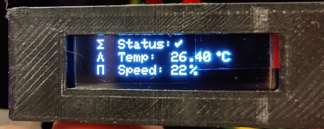
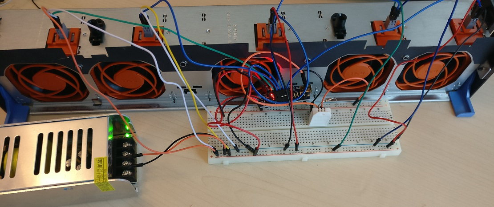

# FanContoler

This software will control the speed of 5 fans depending on the current temperature. It will also print status information on the LCD screen.

## Hardware

### Components

Required materials: 

- 5 PWM Fans (Pulse Width Modulation)
- 1 temp/humidity sensor DHT22
- a 4.7k resistor
- a screen OLED I2C Display SSD1306 128x32
- Arduino
- 12V power supply

### Assembly

### Connections

The software is expecting the following connections:

- D5 : PWM Command Fan #1
- D6 : PWM Command Fan #2
- D9 : PWM Command Fan #3
- D10 : PWM Command Fan #4
- D11 : PWM Command Fan #5
- D13 : Signal DHT22
- A5 : SDA I2C OLED
- A4 : SLC I2C OLED
- 5V : VCC DHT22
- 5V : VCC I2C OLED
- GND : GND 12V DC
- GND : GND I2C OLED
- GND : GND DHT22

## Software

The software will read the sensor's temperature and then adjust the fans speed in the range 20°C to 70°C.

You must include the library [DHTLIB](https://github.com/be-ys/Arduino/tree/master/libraries/DHTlib) to the project and the following Arduino libraries: LiquidCrystal version 1.0.7, Adafruit GFX Library 1.5.7, Adafruit SSD1306 version 1.3.0 and LuiquidCrystal I2C 1.1.2.

## Results

The screen is showing the status of the sensor, the temperature and the current speed:

Testing it with an Arduino nano:

